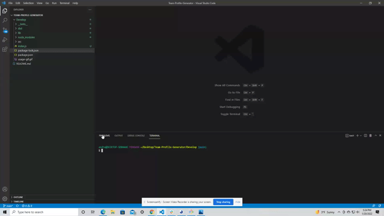

# **Team-Profile-Generator**
  
  
  ## **Description**
  This application allows the user to input a manager's name, employee ID, thier email address, and their office number. Once those are inputed, the user will then be given an option to add more employees. Each of those options will bring their own questions, and those will need to be answered. Once all of the employees have been entered, the program will take the input and generate an HTML file with each employee getting their own card that contains all of the information that was entered. 

  ## **Table of Contents**
  - [Installation](#installation)
  - [Usage](#usage)
  - [License](#license)
  - [Links](#links)
  - [Questions](#questions)

  ## **Installtion**
  The user will have to clone the repository from GitHub and also download node. They will also be required to install Inquirer, FS, and jest.

  ## **Usage**
  
  

  ## **License**
This project is license under MIT.

## **Links**
ScreenCasitfy Video Link : https://watch.screencastify.com/v/w5gRanzQI1GXaSmJvVQi

GitHub Respoistory Link: https://github.com/AndrewSchoenbauer/Team-Profile-Generator
## **Questions**
If you have any questions about this project please email me at andrewschoenbauer12@gmail.com. 

If you would like to view any of my other projects please visit my [GitHub](https://github.com/AndrewSchoenbauer).

